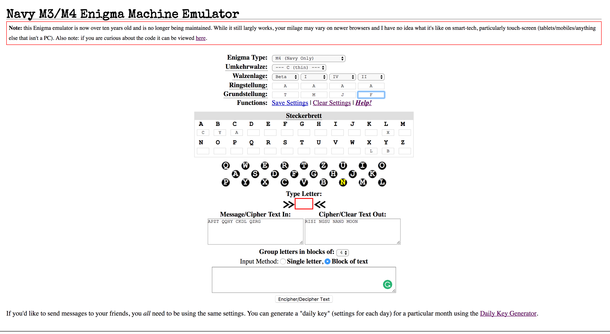

TMCTF--2107
===
## reversing1
.rdata:0040507C 00000036 C Please find sweets name starting from m for biscuit2.


20 3D 40 ? = TMCTF{biscuit3_ biscuit5}

"biscuit"最初の５文字をとる -> biscu　をshift_char("abcdefghijklmnopqrstuvwxyz"となんかしてる) -> choux
TMCTF{choux_cream}
ヒントに騙された

## Analysis-Offensive-100
`Forensic_Encyption`のマジックナンバーがMZになってるので、PKに直してunzip(きづかなかた)

するとfile_1(jpeg), file_2(zip), file_3(pcap)が出てきて、file_1(jpeg)のcommentを見ると,
`VHVyaW5nX01hY2hpbmVfYXV0b21hdG9u`
とあり、

base64でデコード -> `Turing_Machine_automaton`

これがfile_2(.zip) のパスワード

展開 -> 7z Turing_Machine_automaton
key.txtがある IPSec
```
src 192.168.30.211 dst 192.168.30.251
        proto esp spi 0xc300fae7 reqid 1 mode transport
        replay-window 32
        auth hmac(sha1) 0x2f279b853294aad4547d5773e5108de7717f5284
        enc cbc(aes) 0x9d1d2cfa9fa8be81f3e735090c7bd272
        sel src 192.168.30.211/32 dst 192.168.30.251/32
src 192.168.30.251 dst 192.168.30.211
        proto esp spi 0xce66f4fa reqid 1 mode transport
        replay-window 32
        auth hmac(sha1) 0x3bf9c1a31f707731a762ea45a85e21a2192797a3
        enc cbc(aes) 0x886f7e33d21c79ea5bac61e3e17c0422
        sel src 192.168.30.251/32 dst 192.168.30.211/32
```
復号方法　- http://saitoh.hatenablog.jp/entry/2014/09/29/022926

```
M4 Navy
Reflector:C Thin, beta, I, IV, II (T M J F), Plugboard: L-X/A-C/B-Y

TMCTF{APZTQQHYCKDLQZRG}

APZTQQHYCKDLQZRG is encrypted.
```
エニグマ暗号なので、サイトで復号
http://enigma.louisedade.co.uk/enigma.html


