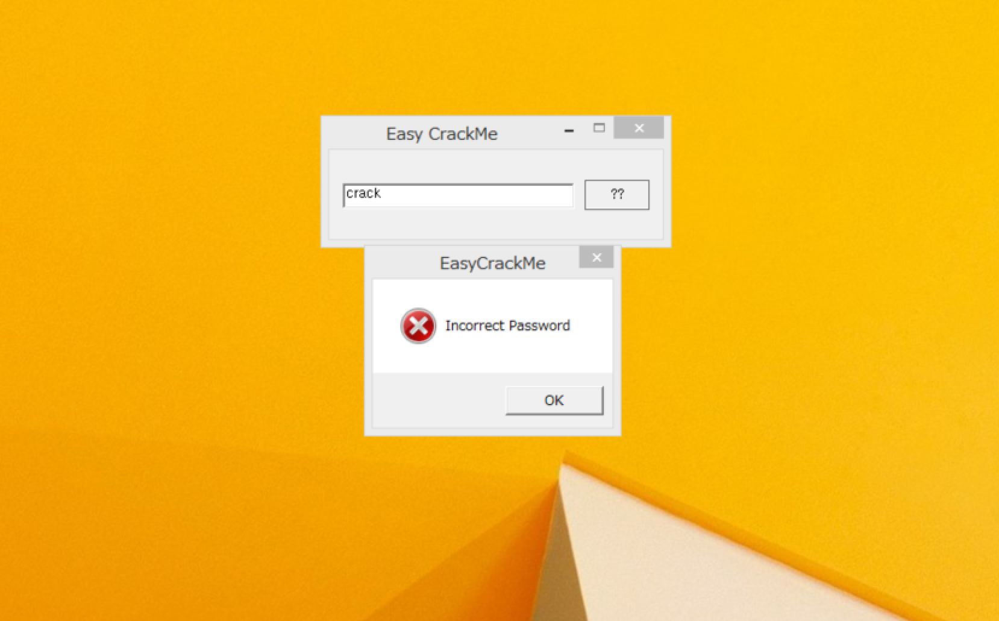
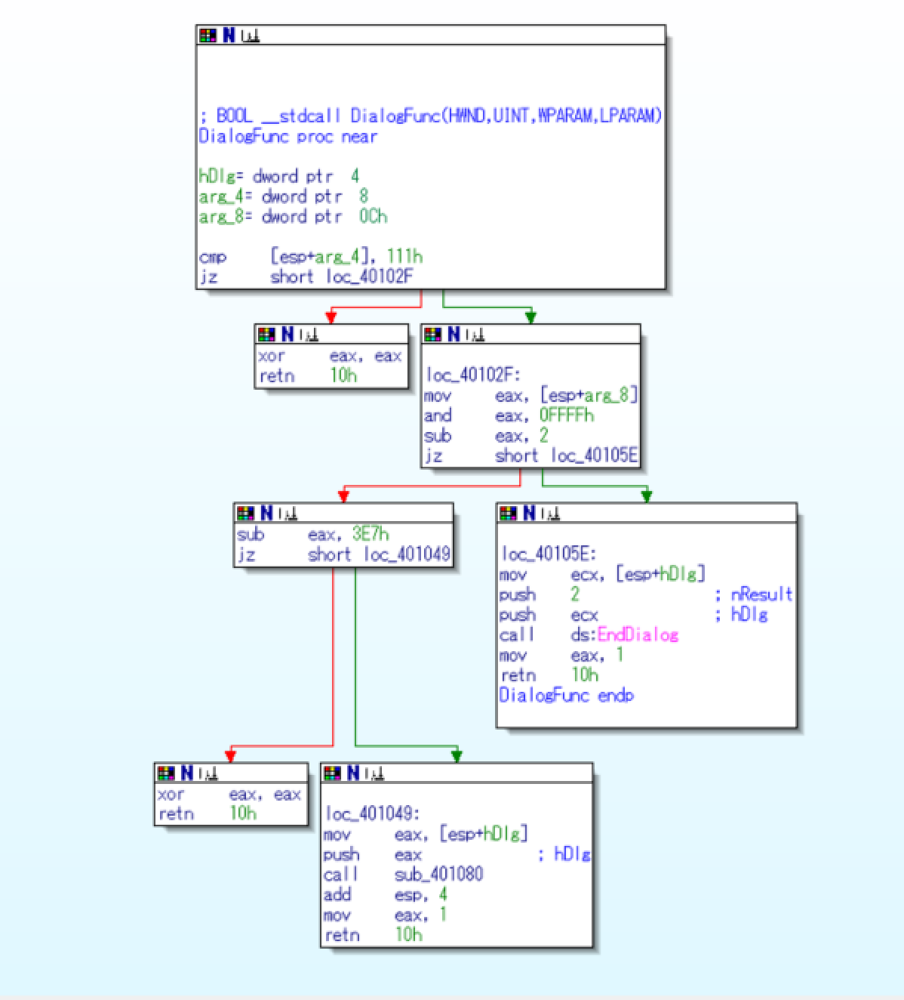
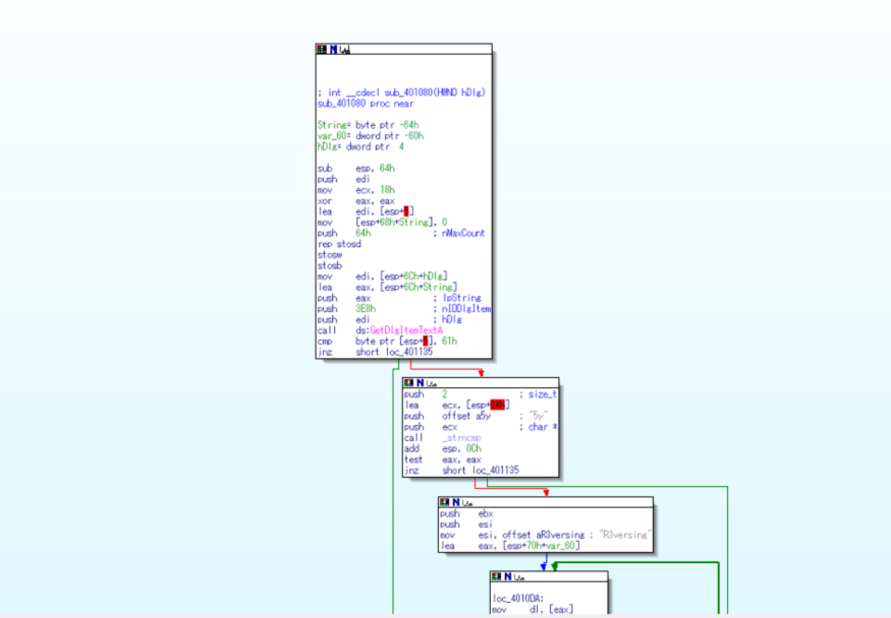
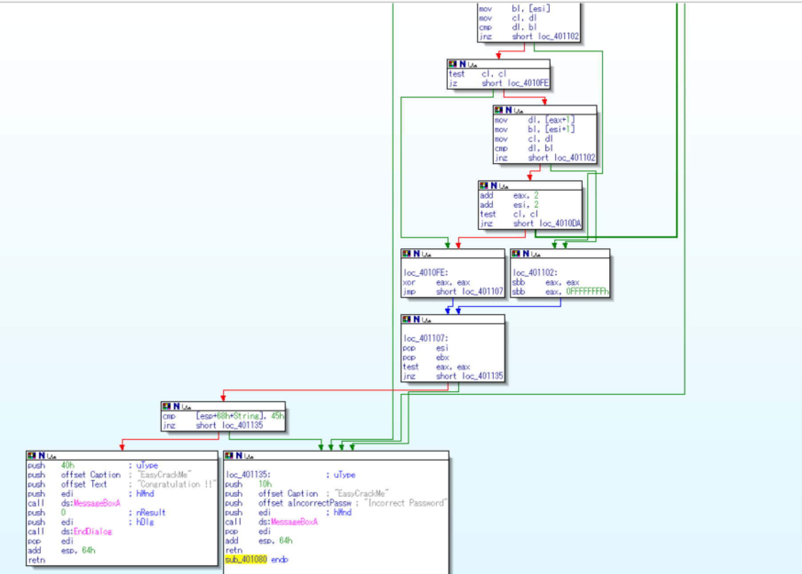

## Eazy Crack

特定の文字列を入れて、フラグをとるアプリケーション.



IDAで見ていく。

WinMain()を見ると以下のようになってる。(functionリストからWinMainを探すことも可)
```
; int __stdcall WinMain(HINSTANCE hInstance,HINSTANCE hPrevInstance,LPSTR lpCmdLine,int nShowCmd)
_WinMain@16 proc near

hInstance= dword ptr  4
hPrevInstance= dword ptr  8
lpCmdLine= dword ptr  0Ch
nShowCmd= dword ptr  10h

mov     eax, [esp+hInstance]
push    0               ; dwInitParam
push    offset DialogFunc ; lpDialogFunc
push    0               ; hWndParent
push    65h             ; lpTemplateName
push    eax             ; hInstance
call    ds:DialogBoxParamA ; Create a modal dialog box from a
                        ; dialog box template resource
xor     eax, eax
retn    10h
_WinMain@16 endp
```

`int __stdcall DialogBoxParamA(HINSTANCE hInstance,LPCSTR lpTemplateName,HWND hWndParent,DLGPROC lpDialogFunc,LPARAM dwInitParam)`が呼ばれてる。
ドキュメントを見ると以下のような定義.(https://msdn.microsoft.com/ja-jp/library/cc410761.aspx)
```
int DialogBoxParam(
  HINSTANCE hInstance,  // アプリケーションのインスタンスのハンドル
  LPCTSTR lpTemplateName,  // ダイアログボックステンプレートを指定します
  HWND hWndParent,      // オーナーウィンドウのハンドル
  DLGPROC lpDialogFunc, // ダイアログボックスプロシージャへのポインタ
  LPARAM dwInitParam    // 初期値
);
```

引数を見ると、`DialogBoxParamA(eax, e(65), 0, offset DialogFunc, 0)`

DialogFuncを追っていく。



下まで分岐していくと、`call sub_401080`に飛ぶ




それらしい文字列が見えた。下の方では、`Congratulation !!`, `Incorrect Password`の分岐があるので`Congratulation !!`にたどり着くように見る。

まず、最初の分岐は
```
cmp byte ptr [esp+5], 61h
jnz short loc_401135
```
から、２文字目が、61h(a) であれば右に進む。

次に、`strcmp(ecx(esp+0Ah), 5y, 2)`で３文字目からと、5yを２文字分比較、つまり3,4文字目が5yなら下に進む

```
push    ebx
push    esi
mov     esi, offset aR3versing ; "R3versing"
lea     eax, [esp+70h+var_60]
```
で、esiに文字列R3versingへのオフセット、eaxに[esp+70h+var_60(-60h)]つまりesp+10h, 5文字目からを入れる。

次に、これらを比べて同じなら左へ分岐。そして、eaxを初期化

最後の分岐で
```
cmp     [esp+68h+String(-64h)], 45h
jnz     short loc_40113
```
Stringやvar_60は一番上で定義されてる。

つまりesp+68h-64h, esp+4hなので、１文字目が、45h(E)なら`Congratulation`へいく。

結果、答えは`Ea5yR3versing`となる.
